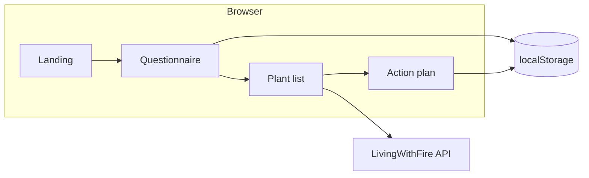

# FireWise Landscape Planner

Open-source, client-side MVP that guides Pacific Northwest homeowners through a structured questionnaire and produces fire-aware plant recommendations plus a phased action checklist. Product behavior is defined in [`docs/FireWise_Landscape_Planner_Spec.md`](docs/FireWise_Landscape_Planner_Spec.md).

## Tech stack

- **Next.js 16** (App Router) + **React 19**
- **TypeScript** (strict)
- **Tailwind CSS 4**
- **npm** as the package manager
- **No extra runtime dependencies** beyond the `create-next-app` baseline (HTTP via native `fetch` only)

## Plant data source

All plant data comes from the **Living with Fire API**:

- Human-readable overview: [https://lwf-api.vercel.app/](https://lwf-api.vercel.app/)
- JSON + OpenAPI: [https://lwf-api.vercel.app/api/v2/docs-raw](https://lwf-api.vercel.app/api/v2/docs-raw)
- Field dictionary: [https://lwf-api.vercel.app/plant-fields.json](https://lwf-api.vercel.app/plant-fields.json)

`src/lib/plantApi.ts` centralizes access. Override the base URL with:

```bash
NEXT_PUBLIC_PLANT_API_BASE=https://lwf-api.vercel.app/api/v2
```

## Local development

```bash
npm install
npm run dev
```

Visit [http://localhost:3000](http://localhost:3000).

```bash
npm run build   # production bundle
npm start       # serve the production build
```

## Architecture (high level)



- **Questionnaire** (8 steps + review) saves answers in `localStorage` (`src/lib/localStorage.ts`).
  - **ZIP → USDA**: uses an approximate **3-digit ZIP prefix** map for **WA, OR, ID** in [`src/data/pnw-zip-prefix-to-usda-zone.json`](src/data/pnw-zip-prefix-to-usda-zone.json); users can always override manually. Extend the JSON for better coverage—no geocoder dependency.
  - **Saved sessions**: older keys stored with a single `topPriority` are migrated to **`priorities[]`** on load (`normalizeQuestionnaireAnswers` in `src/lib/questionnaireState.ts`).
- **Recommendations** load a capped batch of detailed plant records (`loadPlantsForPlanning`), then filter/score via `src/lib/filterPlants.ts` (hardiness from API **Hardiness Zone**, sun from **Light Needs**, pollinators from **Benefits**, deer from **Deer Resistance**—see `plant-fields.json`).
- **Action plans** are derived from answers + recommendations inside `src/lib/generateActionPlan.ts`.
- **PDF export** uses the browser’s **Print → Save as PDF** flow (`window.print()` + print styles in `globals.css`).

## Key directories

| Path | Purpose |
| --- | --- |
| `src/app/` | App Router pages (`/`, `/questionnaire`, `/results`, `/action-plan`, `/about`) |
| `src/components/` | Feature-oriented UI (questionnaire, results, layout, home) |
| `src/lib/` | API gateway, filtering, persistence, action-plan builder, ZIP lookup |
| `src/data/` | Curated PNW ZIP prefix → USDA zone JSON |
| `src/types/` | Shared TypeScript domain models |
| `docs/` | Product specification (`FireWise_Landscape_Planner_Spec.md`) |

## Contributing

1. Keep API calls inside `src/lib/plantApi.ts`.
2. Extend recommendation logic in `src/lib/filterPlants.ts` with comments explaining scoring.
3. Prefer small components (<300 lines per `.tsx` file).
4. Match accessibility and layout guidance in `.cursor/rules/`.

## Roadmap

Future phases may include accounts, neighborhood tooling, satellite planning, and richer PDF exports — see Section 13 of the product spec. Extension points are tagged with `// TODO: [Phase 2]` where backend integration is anticipated.

## License

Add an explicit license file that matches your organization’s policy (MIT, Apache-2.0, etc.). Until then, treat contributions as proprietary to the repository owner.
